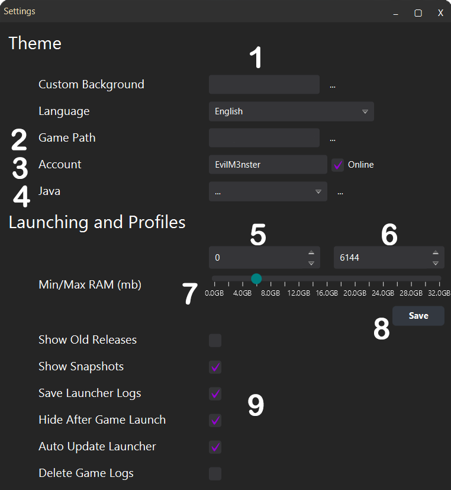
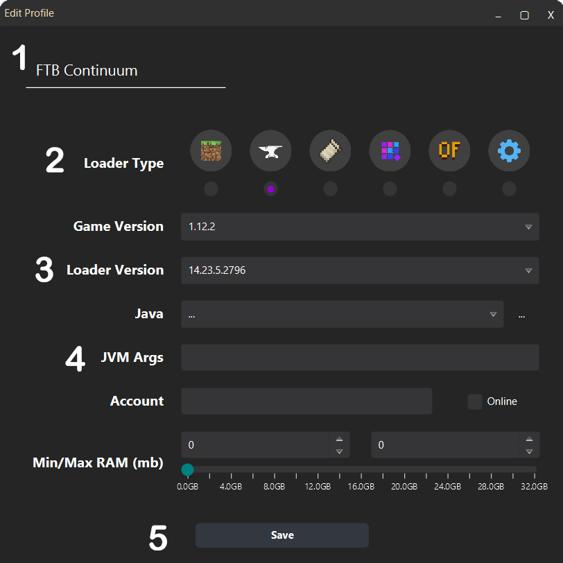
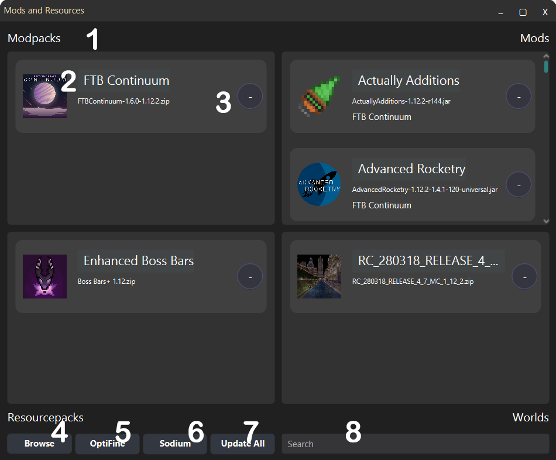
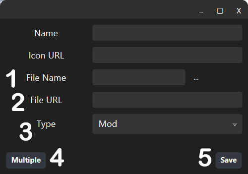
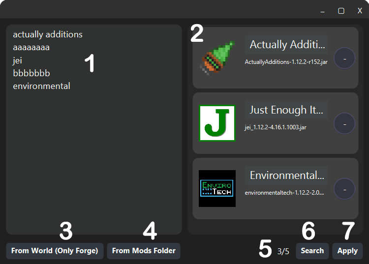
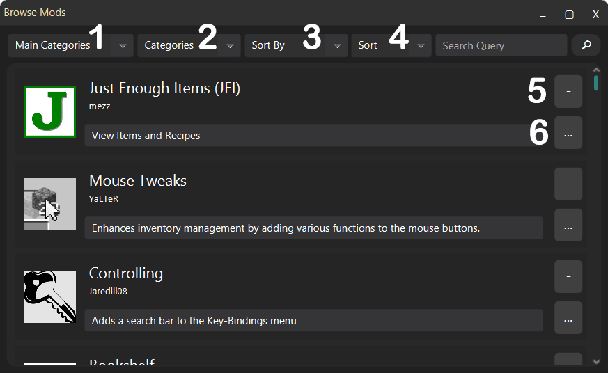
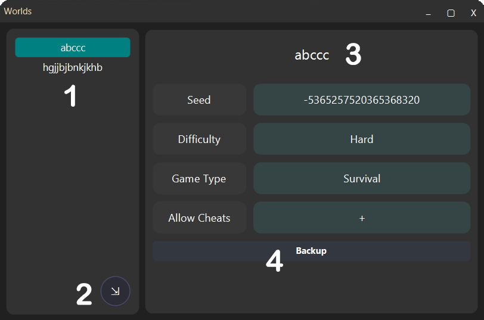

# CoreLauncher
A minimalized, deeply customizable launcher for Minecraft.

# Social

[Discord](https://discord.gg/MEJQtCvwqf)

[Reddit](https://www.reddit.com/r/corelauncher/)

## Why should I use CoreLauncher?
Because,
- It is fast.
- It is small.
- It is modular.
- It is open source.
- It contains the CurseForge and the Modrinth APIs.
- It built with useful and minimalized UI.
- It includes the most used modding APIs like Forge and Fabric.
- It supports CLI.
- It downloads the requiring Java itself.
- You can download multiple modpacks in one profile.
- You can see your worlds (including seeds, game mode and world's spawnpoint) in one, and resources (mods, resourcepacks, modpacks, and worlds) in one page.
- You can easily backup, import and share your profiles and worlds.
- Also, it supports the offline and online authentication.

Create profile, select you loader (wrapper), customize your resources, and play!

## How can I download it?
CoreLauncher works with Java 17, so first you have to download and add to the system path Java 17.

### Downloading Java 17
0) If you have earlier version of Java
   1) Delete it or
   2) Remove it from the system path variable or
   3) Use launch script to start the launcher
1) Go to [Java 17 Download Page](https://www.oracle.com/java/technologies/javase/jdk17-archive-downloads.html)
2) Download (JDK or JRE) and install it based on your OS
3) Check the path variable after install. (it should be like `.../jre|jdk 17.../bin`)

### Downloading Launcher
You can download the latest version of the launcher from it's website.
[Click Me](https://etkmlm.github.io/CoreLauncher)!

### Launching Launcher
You have two options to launch.
1) Using a launch script. (Look below)
3) Clicking to the JAR twice. (Yup, like a normal app.)

#### Creating a Launch Script

`java -jar CoreLauncher.jar`

You can replace 'java' with custom Java 17 path. (`.../jre|jdk 17.../bin/java.exe`)

Create a launch script (for Unix .sh, for MacOS .command, for Windows .bat) and write this code into it.

In Unix, maybe you need to add 
```
#!/bin/sh
cd "$(dirname "$(readlink -fn "$0")")"
```
to the beggining of the launch script.

In MacOS, maybe you need to add 
```
#!/bin/bash
cd "$(dirname "$0")"
```
to the beggining of the launch script.

If you not changed the JAR path, the launch script and launcher must be in the same directory.


If you listen to my advice, you should create a new folder for the launcher, because the launcher creates a config.json and all of your settings are stored in this file. You don't want to lose it :)

## CLI Commands

### --profile

**Usage:** <code>--profile "profile name"</code>

Starts the launcher directly with the selected profile without opening any GUI.

## --offline

Starts the launcher in offline mode.

## How can I use it?

### Main


1) User section. (If you don't set a profile user, default user will be used.)
2) Selected profile info.
   1) Game version.
   2) Profile name.
3) Start button.
   - You can start the launching process when the button has the play icon.
   - You can stop the launching process when the button has the pause icon.
   - If you click this button when pressing the shift, all game files will download again.
4) Profile info.
   1) Loader icon.
   2) Profile name.
   3) Game version.
   4) Description.
      - If the loader is Vanilla or custom, it shows only count of resourcepacks and worlds.
      - Else, it shows the loader version, count of mods, modpacks, resourcepacks, and worlds.
   5) Action buttons.
      1) Menu button. Opens the profile menu.
      2) Select button. Selects the profile.
   6) The profile menu.
      1) **Mods and Resources:** Opens the resources page. (Contains included mods, modpacks, resourcepacks, and worlds.)
      2) **Worlds:** Opens the local worlds page.
      3) **Complete Backup:** Creates a compressed backup (zip) of the profile.
      4) **Export:** Exports the configuration of the profile. You can easily share this file to another.
      5) **Open Folder:** Opens the profile folder.
      6) **Edit:** Opens the profile edit page.
      7) **Delete:** Deletes the profile.
   7) Add button. Opens an empty profile edit page.
   8) Import button. Imports a profile from zip or json file.
   9) Search field. Searches in the profiles.
   10) Detailed description.
       - Generally, it shows the remaining and total mbs while downloading.
       - Also, it shows the loader installing process while installing the loader.
   11) Settings button.
   12) About button.

## Settings


You can scroll the RAM fields to increase and decrease the RAM.

1) Custom background image selector.
   - If you select any image, the main page controls be a little transparent, and the background has changed.
   - Right click resets the background.
2) Game path selector.
   - When you select a new game path, an alert shows to move your profies to the new game path. Click yes if you wish.
3) Account selector.
   1) Username field.
   2) Mojang account selector. If you check it, the account will mark as a Mojang account.
4) Java selector.
   1) Java versions will show up in this format: {Version Name} - {Java Version}
   2) Option button opens the java manager page.
5) Min RAM field.
6) Max RAM field.
7) Max RAM slider.
8) RAM save button. (Other settings will be saved same time.)
9) Checkboxes.

## Java Manager


You don't need to add a custom Java. The launcher downloads the required Java self. But you may need to add your custom Java to activate your graphic settings. To add, see below.

1) Major version.
2) Version name. (If it is downloaded by the launcher, starts with "JDK".)
3) Path selector. (Not changeable. If you want to change, you need to delete it and add a new one.)
4) Action button.
   - Delete, if the version exists.
   - Add, if the version non exists.
5) Creates a empty row to add a new custom version.

## Profile Edit


1) Profile name.
2) Loader type.
   1) Vanilla
   2) Forge
   3) Fabric
   4) Quilt
   5) OptiFine
   6) Custom
3) Loader version.
   - If you selected Vanilla, OptiFine or custom, it will be empty.
   - If you selected another loader, you cannot save the profile without select a loader version.
4) JVM args.
   - Fill it like "-Dfoo=bar -db -x -d abc"
5) Save and close button.

## Mods and Resources


1) Identifier of the resource.
2) Resource info.
   1) Icon.
   2) Name.
   3) File name.
3) Remove button.
4) CurseForge Browser button. Browse in CurseForge.
5) Modrinth Browser button. Browse in Modrinth.
6) OptiFine button.
   - Only works when the selected loader is Forge.
   - It shows available OptiFine versions to include.
   - {Version Name} - {Forge Version}
7) Update button. Updates all mods and modpacks to their latest version.
8) Custom button. Opens the custom adding page.
9) Search field. Searches in all resources. (Mods, modpacks, resourcepacks, and worlds.)

## Custom Resource Adding


1) File name field. The file name of the resource, it's existing checking on the launch process. You can automize it by selecting a file.
2) File URL field. If you want to share this profile, or use in the future, you have to fill this field. File downloaded from this url when not exists.
3) Type box. It contains "Mod", "Resourcepack", and "World".
4) Multiple button. Opens the multiple adding page.
5) Save button. Adds the mod to your profile.

## Multiple Mod Adding


1) Query area.
   - You should write names like searching in a browser.
   - After the search, unfoundable names will appear here again.
   - You can add browser name (curseforge and modrinth for now) into your query, if you want to search separately from your browser selection. For example, "actually additions curseforge" query will search in CurseForge even if you select Modrinth.
2) Result list. Displays the founded mods.
3) From world button. Shows a world selector. When you select a world, it extracts all mods in it and searches.
   - Only works with Forge for now. (Because of level.dat restrictions.)
4) From mods button. Select the folder that contains your mods, all mod names will appear in query area. (You may want to edit this names, it's not true always.)
5) Browser selector. Select a browser to search in.
6) Status label.
7) Search button. Starts the searching process.
8) Apply button. Adds the mods into the profile.

## Browser


1) Main categories. (Mods, modpacks, resourcepacks, and worlds.)
2) Categories. (Depends on the main category.)
3) Sort by. (Featured, popularity, last update, name, author, total download, category, and game version.)
4) Sort order. (Ascending or descending)
5) Remove button.
6) Menu button. (Includes all versions of the resource.)
   - It includes the latest version in normal, you can select another version with this button.

## Worlds


It doesn't show corrupted or non installed worlds.

1) List of the worlds. (By level name.)
2) Import button. Imports the world from a zip file.
   - The zip file has to contain the level folder in its root, then the level files in it.
3) Level name of the selected world.
4) Backup button. Compresses the selected world as a zip file.
